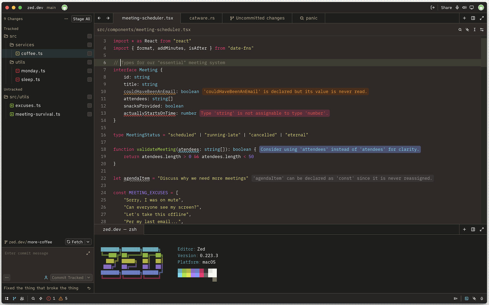

# PKLV Monokai

**Classic Monokai with a warmer touch, tailored for Zed.**

## Description

This theme represents a port of the **Monokai** color palette to the [Zed](https://zed.dev) editor. 

## Installation

0. Clone the repository
1. Open Zed
2. Exec "Install Dev Extensions" (or `Cmd+Shift+X` and push the button in the top right corner)
3. Select cloned repository folder
4. Toggle PKLV Monokai in the list of installed extensions

---

**Enjoy coding!**
